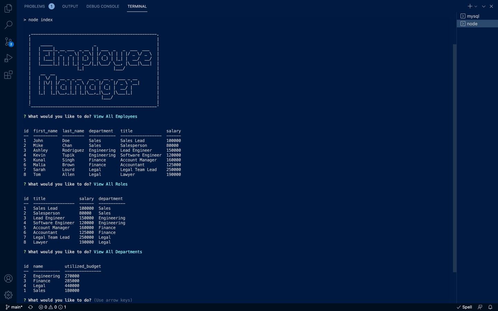

# employee-tracker
 ## **Table of Contents**
* [Description](#Description)
* [Installation](#Installation)
* [Usage](#Usage)
* [Contributing](#Contributing)
* [Questions](#Questions)
* [Tests](#Tests)
* [Website](#Website)
* [License](#License)

## **Description**
Using `MySql` I created an employee database that employers can use to keep track of their employees.

## **Installation**
The following dependencies needed to be installed:
    `"asciiart-logo"
    "console.table"
    "inquirer"
    "mysql"
    "mysql2"`
  

## **Usage**
Keep track of your employees, their salaries, roles, and departments with this database.
## **Contributing**

[Contributor Covenant](https://img.shields.io/badge/Contributor%20Covenant-2.1-4baaaa.svg)

## **Questions**
Please contact me at Katieshake27@gmail.com with any questions.

Visit my gitHub page at https://github.com/kgendaszek!

## **Website**

https://watch.screencastify.com/v/gatKTjKSehHfo9n2wKU9

https://github.com/kgendaszek/employee-tracker

## **License**
### 

[MIT license](https://opensource.org/licenses/MIT)
